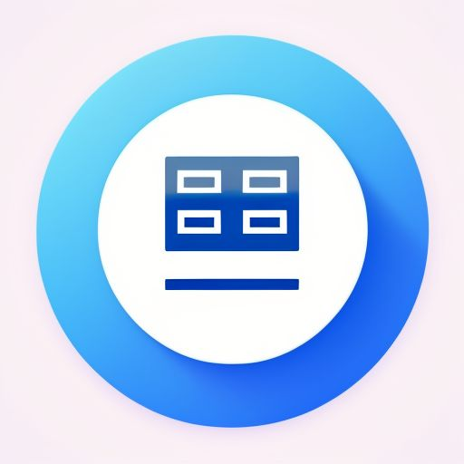

# Event Scan 🎉

Event Scan is a modern Flutter-based app designed to streamline barcode scanning at events like freshers' parties. It ensures smooth and efficient entry management using Firestore databse by checking whether tickets have been scanned before and provides real-time feedback to users.

## Features ✨

- **Real-time Barcode Scanning**: Instantly scans barcodes and checks their status.
- **Animated Feedback**: Provides animated visual and sound feedback on successful or duplicate scans.
- **Firestore Integration**: Leverages Firebase Firestore for storing and retrieving barcode scan data.
- **Multi-Device Support**: Syncs across multiple devices in real-time, ensuring consistent data management.
- **Search Functionality**: Allows users to search through scanned and unscanned barcodes with ease.
- **Customizable Collection Name**: Users can easily change the Firestore collection name with a confirmation dialog.
- **Draggable Bottom Sheet Navigation**: Features a draggable bottom sheet that reveals scanned and unscanned lists, with intuitive navigation buttons.
- **Modular and Clean Codebase**: Built with a focus on modularity and ease of maintenance.

## Screenshots 📸


## Installation 📲

1. **Download the Latest Release**:
   - Visit the [Releases](https://github.com/jeryjs/Party-Scan/releases/latest) page on GitHub.
   - Download the latest `APK` file for Android or the `IPA` file for iOS.

2. **Install the App**:
   - **Android**: 
     - Transfer the `APK` to your device and install it.
     - Multiple variants are available. If the `arm64-v8a` variant fails to install, try installing the `armeabi-v7a` variant.
   - **iOS**: 
     - Download the `IPA` file and use a tool like AltStore or Cydia Impactor to sideload the app onto your iOS device. 
     - Alternatively, if you have access to Xcode, you can build and install the app directly.

3. **Launch the App**:
   - On the first launch, you'll be prompted to set the collection name, which will be used to retrieve your barcodes databse from Firebase.
   - After configuring the collection name, the app is ready to start scanning barcodes!


## Building 🛠️

1. **Clone the Repository**:
   ```bash
   git clone https://github.com/yourusername/party-scan.git
   cd party-scan
   ```

2. **Install Dependencies**:
   ```bash
   flutter pub get
   ```

3. **Configure Firebase**:
   - Set up your Firebase project and add your `google-services.json` and `GoogleService-Info.plist` to the appropriate directories.
   - Make sure Firestore rules are configured to allow read and write access as needed.

4. **Run the App**:
   ```bash
   flutter run
   ```

## Usage 🚀

- **Scanning Barcodes**:
  - Upon opening the app, the camera scanner will start automatically.
  - Scan a ticket by placing its barcode in front of the scanner.
  - The app will show an animated green box with a tick for success or a red box with a cross if the barcode was already scanned.

- **Navigating the Bottom Sheet**:
  - Tap the navigation icons to slide up the bottom sheet, where you can view scanned and unscanned barcodes.
  - Use the search bar at the top of each list to filter by barcode or scan time.

- **Changing the Collection Name**:
  - Tap the settings icon in the top-right corner to open the collection name dialog.
  - Enter a new collection name and confirm to save your changes.
    - Collection names are basically like a private key to let you safely manage your tickets database.

## Contributing 🤝

Contributions are welcome! If you'd like to contribute to this project, please follow these steps:

1. Fork the repository.
2. Create a new branch (`git checkout -b feature/YourFeature`).
3. Commit your changes (`git commit -am 'Add a new feature'`).
4. Push to the branch (`git push origin feature/YourFeature`).
5. Create a new Pull Request.

## License 📄

This project is licensed under the MIT License - see the [LICENSE](LICENSE) file for details.

Feel free to reach out if you have any questions or suggestions! Happy scanning! 🎉
